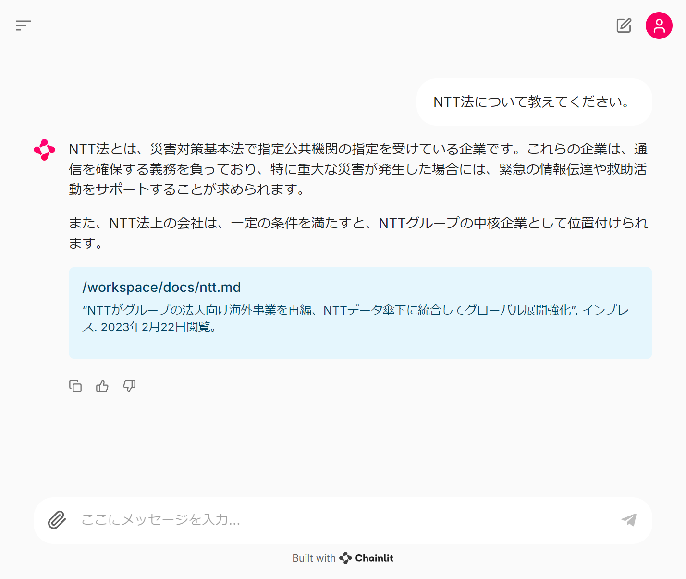
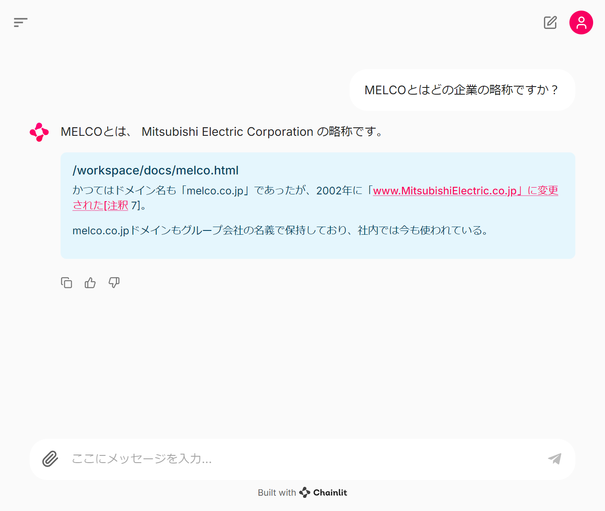

# 🦜 🔗 Simple-RAG

Ollama で LLM を、Chainlit で UI を、Langchain で RAG を構築したやつ。

## システム構成

## 手順

- VSCode で本リポジトリを devcontainer で起動する
- ターミナルで、`chainlit run app.py`を実行
  - ドキュメントをベクトル化するので、だいぶ遅い

## サンプル

- NTT と野村総研、三菱電機の Wikipedia 情報を Markdown/PDF/HTML 形式で入力している

