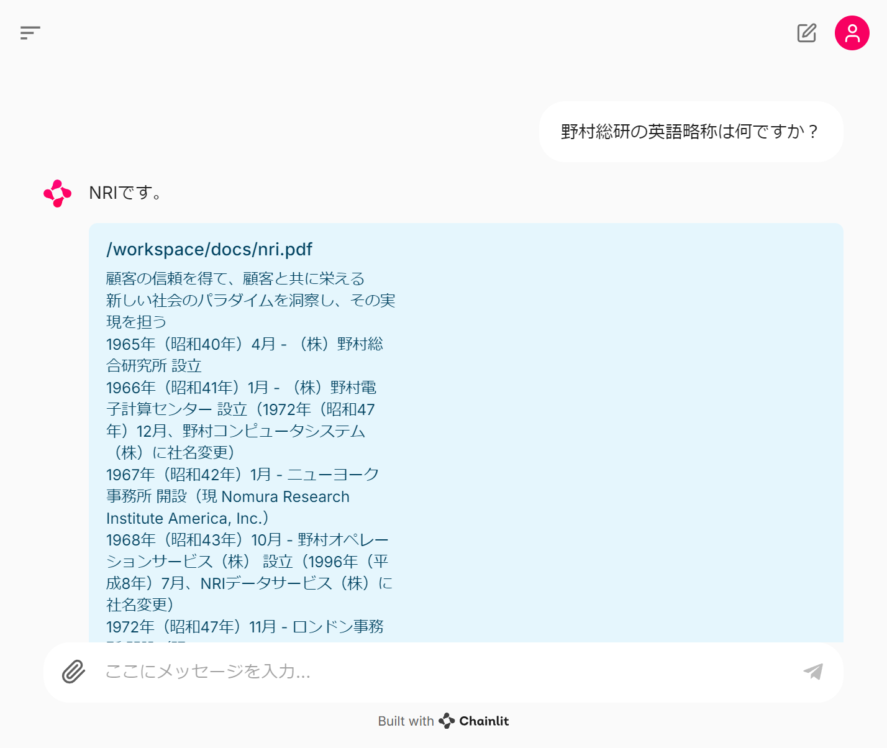

# 🦜 🔗 Simple-RAG

Ollama で LLM を、Chainlit で UI を、Langchain で RAG を構築したやつ。

## システム構成

## 手順

- VSCode で本リポジトリを devcontainer で起動する
- ターミナルで、`chainlit run app.py`を実行
  - ドキュメントをベクトル化するので、だいぶ遅い

## サンプル

- NTT と野村総研、三菱電機の Wikipedia 情報を Markdown/PDF/HTML 形式で入力している
  - NTT法について教えてください。
  - 野村総合研究所の英語略称は何ですか？
  - MELCOとはどの企業の略称ですか？

## 雑な評価

- 各手法で、質問に適したコンテキストを検索できたか？を示す

||NRI|NTT|MELCO|
|:---:|:---:|:---:|:---:|
|RAG                      |x|x|x|
|Re-ranking RAG           |o|x|o|
|Ensemble RAG             |x|x|x|
|Re-ranking & Ensemble RAG|o|x|o|

- RAG

- Re-ranking RAG

- Ensemble RAG

## 考察

- HTMLとMarkdownファイルがText Splitterによって、分割されすぎていて検索の際に意味が通じていない
